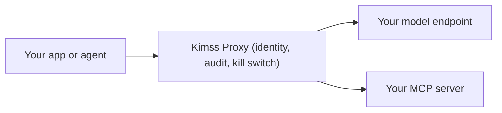

# Kimss Java SDK

[](https://central.sonatype.com/artifact/com.kimss/kimss-java)
[](LICENSE)
[](https://github.com/eyal81/kimss-java-sdk/actions/workflows/ci.yml)

Your AI traffic is probably unmanaged: provider keys hardcoded in config files, services calling models directly, no record of who made which call and no way to stop the next one. That is **Shadow AI**.

[Kimss](https://kimss.ai) is an **Enterprise Agent Control Plane** — a zero-trust gateway that sits in front of the model endpoints you already own. This SDK is the Java integration layer: it routes your calls through the Kimss gateway (`X-Kimss-Key`), where every request gets identity, a governed audit trail, and a kill switch. Kimss never hosts your models and never charges for inference compute.



Source of truth: monorepo path `kimssApi/kimss_java_sdk/`. Public GitHub is a subtree mirror (same pattern as the Python SDK).

## Requirements

- JDK **11+**
- Dependency: Jackson Databind (pulled transitively)

## Installation

### Maven

```xml
<dependency>
  <groupId>com.kimss</groupId>
  <artifactId>kimss-java</artifactId>
  <version>0.1.0</version>
</dependency>
```

### Gradle

```kotlin
implementation("com.kimss:kimss-java:0.1.0")
```

> **To route traffic, you must create a free control plane namespace. [Get your API key at kimss.ai](https://kimss.ai/app/signup) (25,000 governed requests/mo included. No credit card).**
>
> The Developer tier is always free — 25,000 governed requests/month, 14-day telemetry retention, no expiration cliff.

Until the artifact is on Maven Central, use a local install:

```bash
cd kimss_java_sdk
mvn -q -DskipTests install
```

Or call the REST API with JDK `HttpClient` and header `X-Kimss-Key` (see Developer Hub **Java** tab).

## Quick start

```java
import com.kimss.AgentRunResult;
import com.kimss.KimssClient;

// Uses KIMSS_API_KEY and optional KIMSS_BASE_URL
KimssClient client = KimssClient.fromEnv();

AgentRunResult result = client.agents().run("asst_...", "Hello from Java!");
System.out.println(result.text());
```

Or explicitly:

```java
KimssClient client = KimssClient.builder()
    .apiKey(System.getenv("KIMSS_API_KEY"))
    .baseUrl("https://api.kimss.ai")
    .build();
```

## Auth

| Mode | Header |
|------|--------|
| API key (default) | `X-Kimss-Key: <key>` |

Do **not** send Kimss API keys as `Authorization: Bearer`.

## Preferred endpoints

| Method | HTTP |
|--------|------|
| `client.agents().run(...)` | `POST /v1/agents/run` |
| `client.models().create(...)` | `POST /v1/models/completions` |

## Publish (maintainers)

1. Claim / register Maven Central namespace `com.kimss`.
2. On first publish to the public mirror, copy `ci-templates/publish.yml` → `.github/workflows/publish.yml` and `ci-templates/ci.yml` → `.github/workflows/ci.yml` (requires a PAT with **`workflow`** scope; subtree mirror cannot push `.github/workflows` with deploy keys or OAuth tokens lacking that scope).
3. Configure GitHub secrets on the public mirror for Central publishing + GPG.
4. Tag `v0.1.0` on the public mirror to run publish.

See monorepo `plans/2026-07-23-kimss-java-sdk-release-routine.md`.

